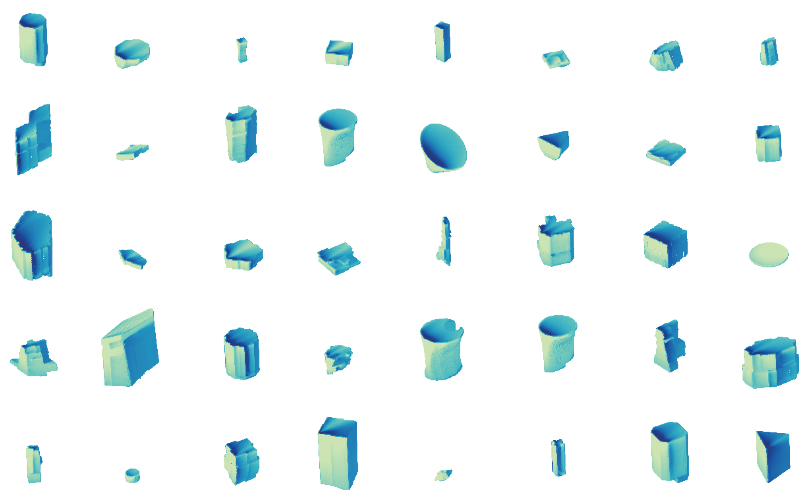
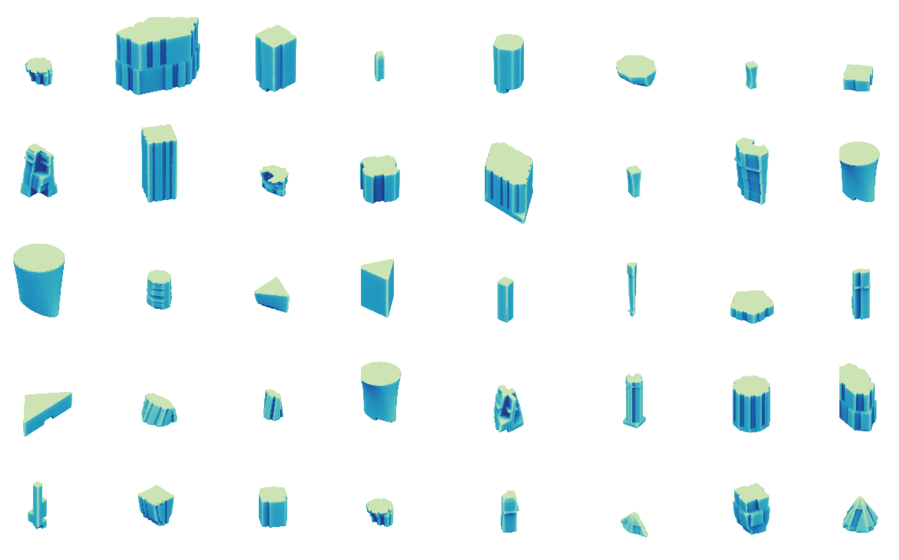
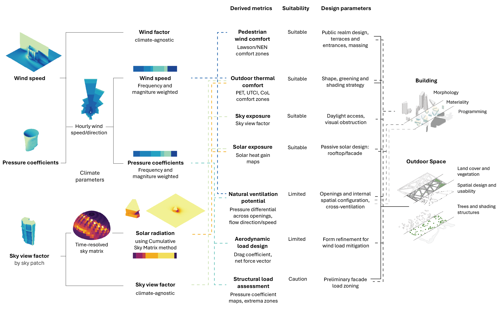

# PRISM: A multi-modal dataset for learning-based building performance modeling

This repository provides the supporting code for the **PRISM (Performance Representation Informed by Shape and Morphology)** dataset. It is a publicly available dataset that systematically links building geometry with high-fidelity simulation outputs across multiple environmental domains. PRISM features high morphological diversity, spanning basic extrusions to highly articulated forms; multi-modal geometric representations, including watertight surface meshes, signed distance fields and structured descriptors; and multi-physics simulation outputs from computational fluid dynamics (velocity, pressure) and solar exposure (sky view factor by sky patch). PRISM supports a wide range of research applications, including surrogate modeling, geometry-conditioned performance prediction, inverse design, generative modeling, and large-scale design-space exploration.

## Repository Contents

The repository contains tools for processing and visualization, morphology characterization, dataloader setups for direct integration with deep learning frameworks, and baseline implementations for learning-based surrogate modeling. It follows the following structure

```
PRISM/
├── src/
│   ├── prism/                  # dataset processing and visualization
│   ├── prism_morphology/       # morphology metrics 
│   └── prism_baselines/        # training loops, experiments, loaders
├── third_party/                
│   ├── neural_solver_library/
│   └── 3d_building_metrics/
├── requirements-dataset.txt
├── requirements-geometrics.txt
├── requirements-baselines.txt
├── LICENSE.md
├── UPSTREAM.md
└── README.md
```

- All **our code** lives under `src/`
- **Third-party repos** are tracked as submodules in `third_party/`  
- Requirements are split into three files to facilitate selective use: `requirements-dataset.txt` for the processing and visualization of the dataset, `requirements-geometrics.txt` for the calculation of 3D shape metrics, and `requirements-baselines.txt` for the baseline surrogate models.

## Dataset Description

PRISM comprises 4759 procedurally generated building geometries, including 4344 unique forms and 415 matched extrusions, derived from a parametric model with 19 building-level and 8 dataset-level parameters. A representative subset of 831 geometries is paired with high-resolution CFD simulations conducted across 1 to 8 cardinal wind directions per model, with an average of 7.6 directions per case, resulting in 4769 simulation instances. Mesh sizes for the full domain range from 16 to 38 million cells, with an average of 27 million, while the building meshes contain an average of 33000 cells. Sky view factor (SVF) calculations are provided for all 4759 geometries using a sky patch discretization scheme that supports downstream radiation analysis. Each geometry is available in multiple formats, including watertight surface meshes, point clouds, and structured descriptors, and is paired with corresponding velocity, pressure, and SVF-by-patch values. The dataset totals 5.3 TB in compressed form and exceeds 12.5 TB uncompressed. It is hosted on the Dataverse through the anonymized link: [PRISM](https://dataverse.harvard.edu/previewurl.xhtml?token=57c1017c-2ff4-4b78-8f3e-4608b3ccb5ea).

<p align="center">

</p>

<p align="center" float="left">
  
  
</p>

This dataset is intended to support a wide range of early-stage design applications including outdoor thermal comfort, radiation studies, preliminary structural design guidance, etc. Raw fields can be used directly (climate-agnostic) or composed with climate inputs to derive application metrics. Examples include wind-speed magnitude, exceedance probabilities and comfort classes (from directional distributions and log-profile scaling), and patch-weighted irradiance or daylight proxies via SVF aggregation over the 577-patch Reinhart sky.

<p align="center">
  
</p>

## Citation

When using or extending this code or dataset, please cite using the following:

```
@misc{prism2025,
  title  = {PRISM: A multi-modal dataset for learning-based building performance modeling},
  author = {Anonymous},
  year   = {2025},
  url    = {https://dataverse.harvard.edu/previewurl.xhtml?token=57c1017c-2ff4-4b78-8f3e-4608b3ccb5ea}
}
```


